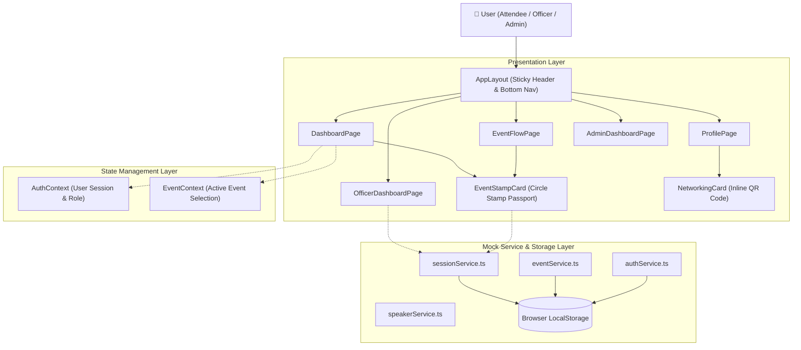
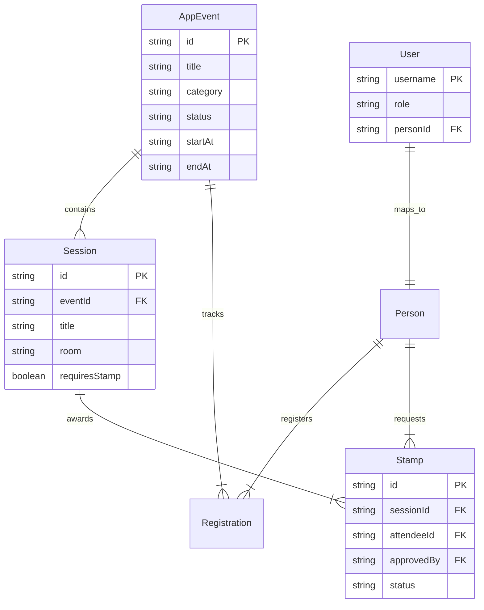

# AWS SBG-APC Event Tracker — System Architecture 📐

This document describes the architectural layout, data flow, component hierarchies, and design principles of the **AWS SBG-APC Event Tracker** application.

---

## 🏗️ High-Level System Architecture

---

## 🧩 Architectural Layers

### 1. Presentation & Component Layer
- **`AppLayout.tsx`**: Main structural layout wrapper implementing:
  - Sticky mobile `AppBar` (`position="sticky"`, `borderRadius: 0`) with title truncation.
  - Inline collapsible menu (`Collapse`) for mobile navigation without backdrop overlays.
  - Desktop permanent sidebar `Drawer` for `md+` screen sizes.
  - Fixed mobile `BottomNav` bar for thumb-friendly navigation on `xs` viewports.
- **`EventStampCard.tsx`**: Self-contained component that computes event session stamp slots dynamically:
  - Reads active event sessions and attendee stamp status.
  - Renders grid of circular slots representing each workshop/session.
  - Handles one-tap stamp requests and displays approval state transitions (`approved`, `pending`, `unclaimed`).
- **`NetworkingCard.tsx`**: Inline, non-overlay profile card generating external QR code images using QR Server API.

### 2. State Management Layer
- **`AuthContext.tsx`**:
  - Manages active user session (`User | null`).
  - Handles authentication operations (`login`, `logout`, `signup`).
  - Persists session tokens and user state in `localStorage` under `aws-event-tracker.auth.v2`.
- **`EventContext.tsx`**:
  - Maintains currently selected active event (`AppEvent | null`).
  - Persists event context in `localStorage` under `aws-event-tracker.selectedEvent.v2`.

### 3. Service & Mock Data Layer
- **`sessionService.ts`**: Handles session lookup, stamp creation (`createStamp`), stamp approvals (`approveStamp`), and declines (`declineStamp`).
- **`eventService.ts`**: Handles event CRUD operations.
- **`authService.ts`**: Handles credentials lookup and role updates (`updateUserRole`).
- **`seedData.ts`**: Provides initial mock dataset seeded into `localStorage` on first load.

---

## 🎨 Mobile-First & "No-Overlays" Design Principles

1. **Inline Flow over Modal Popups**:
   - Replaced `<Dialog>` and full-screen backdrop modals with inline `<Card>` and `<Collapse>` elements.
   - Eliminates z-index conflicts, focus-trap bugs, and dark backdrop screens on mobile devices.

2. **Edge-to-Edge Header & Bottom Bar**:
   - Navigation header uses `position="sticky"` with `borderRadius: 0` to prevent floating card overlays.
   - Bottom navigation bar (`BottomNav`) is fixed at `bottom: 0` with `zIndex: 1200` and padded content offset (`pb: 10`).

3. **Responsive Grid Layouts**:
   - Grid containers adapt automatically: 1 column on mobile (`xs`), 2 columns on tablet (`sm`), and 3 columns on desktop (`md`).

---

## 🗄️ Entity Relationship Diagram (ERD)

---

## 🔒 Security & Access Control (RBAC)

| Role | Permissions |
| :--- | :--- |
| **`attendee`** | View schedule, request stamps, edit personal bio/socials, view own stamp card. |
| **`officer`** | All attendee privileges + access `OfficerDashboardPage` to approve/decline stamp requests. |
| **`admin`** | All officer privileges + access `AdminDashboardPage` to change user roles. |

---

*Last Updated: October 2026*
